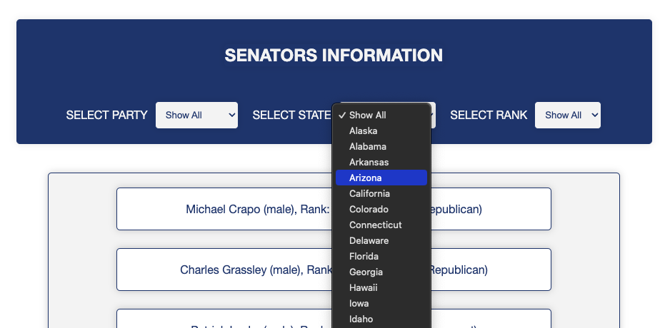
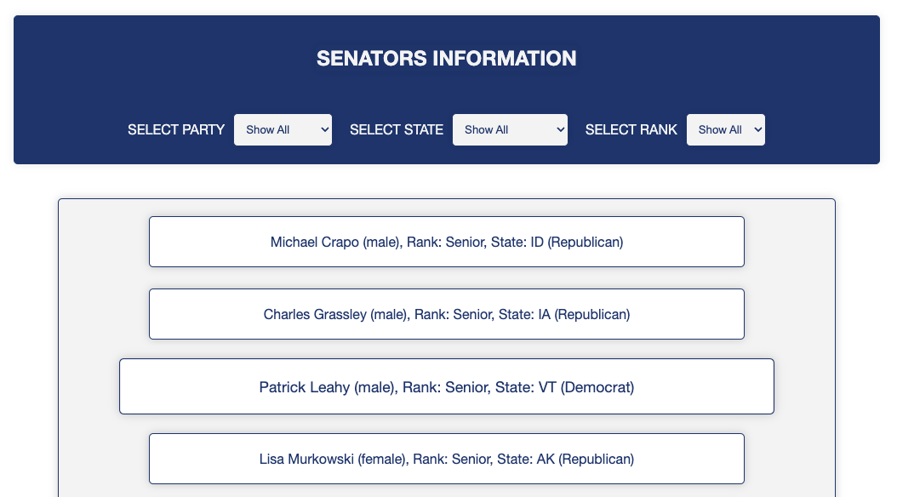

# COMP30680 Web Application Development: Assignment 2: JavaScript & JSON

## Senators Webpage: Overview

This project comprises a **webpage that provides information on members of the US Senate**. This data pertaining to the US Senate and its constituents was retrieved from (www.govtrack.us/); please note that this data is not dynamically updated and thus might not accurately represent the current state of the US Senate.

## Table of Contents

- Restrictions & Requirements
- Key Features
- How to Use

## Restrictions & Requirements

As this project was created for an assigment, there were several restrictions and requirements that the project had to accomodate.
The project had to be coded such that:

- The project was composed entirely of **HTML5, CSS3 & Vanilla JavaScript (ES6)**, no other languages were permitted
- The use of frameworks, incl. JavaScript frameworks e.g., JQuery, were not permitted
- The webpage consisted of a single index file named **senators.html**

Upon loading and fully rendering, the webpage had to do the following:

- **Requirement 1**
  - Display the total number of senators in each party affiliation
  - Display a list of all the senate members in a leadership capacity: this list needed to group the data by party affiliation
- **Requirement 2**
  - Display all of the senators, with the following information provided for each:
    - Party affiliation
    - Representative state
    - Gender
    - Rank
- **Requirement 3**
  - Implement filters for the information displayed as per **requirement 2**; the filters should allow for the selection of information by:
    - Party affiliation
    - Representative state
    - Rank
- **Requirement 4**
  - Implement a feature that allows the user to select any senator and view further information on said senator; the further information should incl.:
    - Office
    - Date of Birth
    - Start Date
    - Twitter Handle & Youtube Channel (where applicable)
    - External Website Link (redirects to new tab)

## Key Features

### Extracting Data from JSON File: No Hardcoding of Data

There are various means of extracting data from a JSON file; this project implements the **Fetch API** as follows:

```JavaScript
document.addEventListener("DOMContentLoaded", () => {
  fetch("./senators.json")
    .then((response) => response.json())
    .then((data) => {
        //Code to process the JSON and fulfill project specifications goes here.
    }
```

This makes it possible to accomplish the most crucial aspect of the project:"utilising JavaScript to read, manipulate, and present data."

---

### forEach Itertative Method: Processing of Each Data Point

To fulfill **requirements 1, 2 & 3**, the **forEach() iterative method** was used to comb through the senators.json data and process each data point according to the specifications outlined above.
To optimise and improve the readibility of the code:

- All pertinent pieces of information contained within the senator data point were set to appropriately named variables.
- The variables were assigned to corresponding properties in a newly created object
- The data from the object is scrutinised by a series of if conditional statements
- When the boolean operators in the if conditional statements return True, the information is stored, to be displayed

```JavaScript
senators.forEach((senator) => {
        const firstname = senator.person.firstname;
        const lastname = senator.person.lastname;
        const party = senator.party;
        const leadershipStatus = senator.leadership_title

        let senatorLeadershipData = new Object();
        senatorLeadershipData.leadershipStatus = leadershipStatus;
        senatorLeadershipData.firstname = firstname;
        senatorLeadershipData.lastname = lastname;
        senatorLeadershipData.party = party;

        //Use a series of if conditional statements to assess each data point and where (if at all) it should be displayed
         if (partyCounts.hasOwnProperty(party)) {
          partyCounts[party]++;
        }}
```

---

### Rendering of JSON Data in senators.html: No Hardcoding of Data (Cont.)

The information processed by the forEach() method, once stored appropriately, is used to populate empty HTML elements contained within senators.html.

```JavaScript
const democratsCounterElement = document.getElementById(
        "party-affiliations-democrats"
      );

democratsCounterElement.innerHTML = `Democrats: ${partyAffiliationData.Democrat}`;
```

---

### Filtering of Data According to User Preferences

There are 3 different filtering options:

- Select Party
- Select State
- Select Rank

All three of these filters have event listeners which activate filtering functions upon changes to setting. These filters can be compounded i.e., applied simultaneously to further refine the data displayed.

```javascript
function filterSenators() {
        const selectedParty = partyFilter.value;
        const selectedState = stateFilter.value;
        const selectedRank = rankFilter.value;

        filteredSenatorsContainer.innerHTML = "";
        senatorDetailsContainer.innerHTML = "";

        const filteredList = senators.filter((senator) => {
          return (
            (selectedParty === "show-all" || senator.party === selectedParty) &&
            (selectedState === "show-all" || senator.state === selectedState) &&
            (selectedRank === "show-all" ||
              senator.senator_rank_label === selectedRank)
          );
        });
```

---

## How To Use

To filter the senators data, click on the filter dropdowns as seen under the heading **Senators Information** and click on your desired filter setting. N.B. these filters can be compounded e.g., you can search by party, then further refine your search by selecting specific states et cetera.



To select a senator and display more information about them (as outlined in **Restrictions & Requirements: Requirement 4**), click on any of the senators displayed under the heading **Senators Information**.
For example, if I click on _Patrick Leahy (male), Rank: Senior, State: VT (Democrat)_:



...The following information will be displayed at the bottom of the page:


